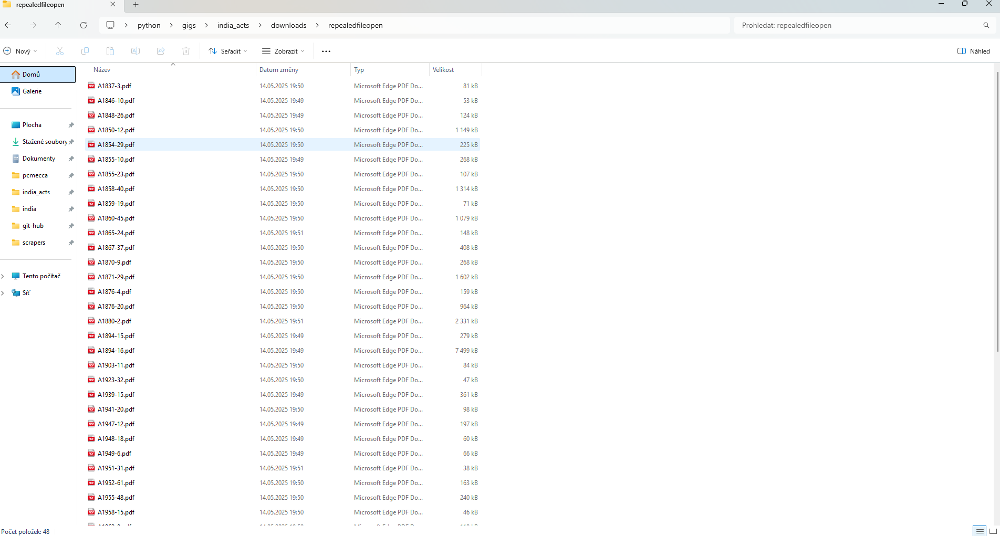
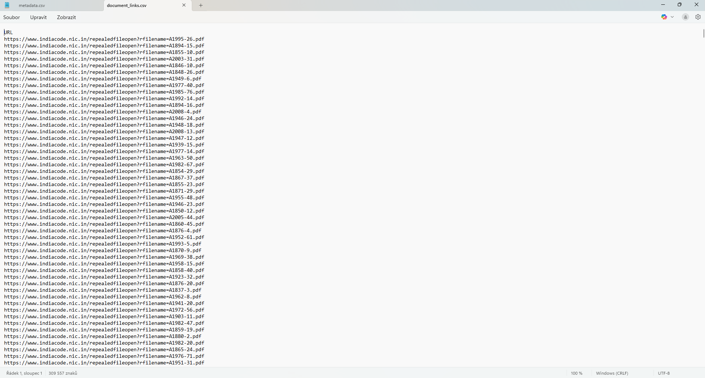
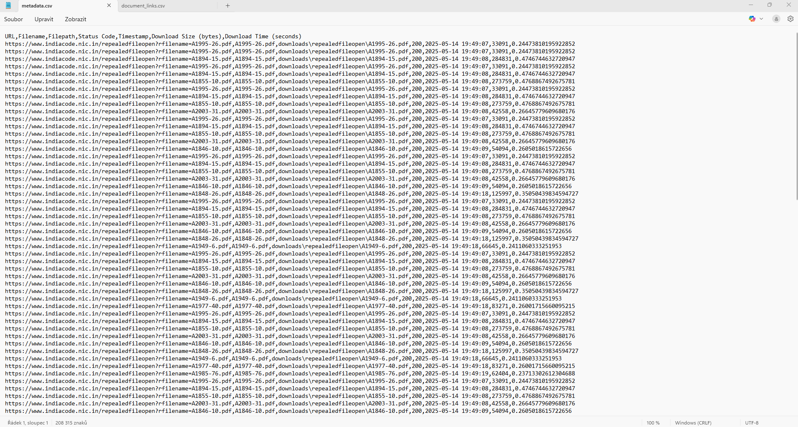
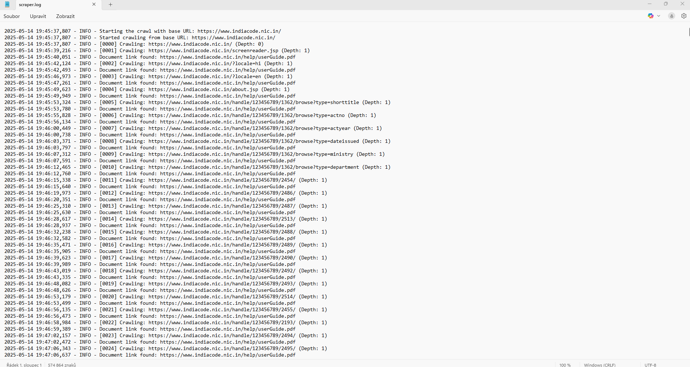

# IndiaCode Web Crawler

A modular and production-ready web crawler for [https://www.indiacode.nic.in/](https://www.indiacode.nic.in/), designed to recursively collect and download legal documents.

---

## 🚀 Features

- Recursive link crawling with depth control
- Filtering of document filetypes (PDF, DOCX, etc.)
- Parallel downloading with batch control
- Logging of successes and failures
- Metadata export in CSV
- Command-line arguments for full configurability

---

## 🖼 Output Preview

### 📁 Downloaded Files
All documents are saved in the `downloads/` folder:



---

### 📄 Extracted Document Links
Saved as `document_links.csv`:



---

### 📝 Metadata Export
CSV of downloaded documents and metadata:



---

### 🧾 Scraper Log
Log of progress and errors:



---

## ⚙️ Usage

```bash
python main.py ^
  --base-url "https://www.indiacode.nic.in/" ^
  --max-depth 2 ^
  --max-files 100 ^
  --batch-size 5 ^
  --export-csv "document_links.csv" ^
  --download-path "downloads" ^
  --failed-log "failed_urls.csv"
```

---

## 🗂 Folder Structure

```
IndiaCode/
├── scripts/
│   ├── main.py
│   ├── crawler.py
│   ├── downloader.py
│   └── ...
├── downloads/
├── metadata/
├── logs/
├── assets/
│   ├── downloads_folder.png
│   ├── document_links_csv.png
│   ├── metadata_csv.png
│   └── scraper_log.png
└── README.md
```

---

## 📬 Author

Martin Votava  
🔗 [github.com/Martin-vot](https://github.com/Martin-vot)  
📧 [martin@example.com](mailto:martin@example.com) (vyměň za svůj email nebo smaž)

---
